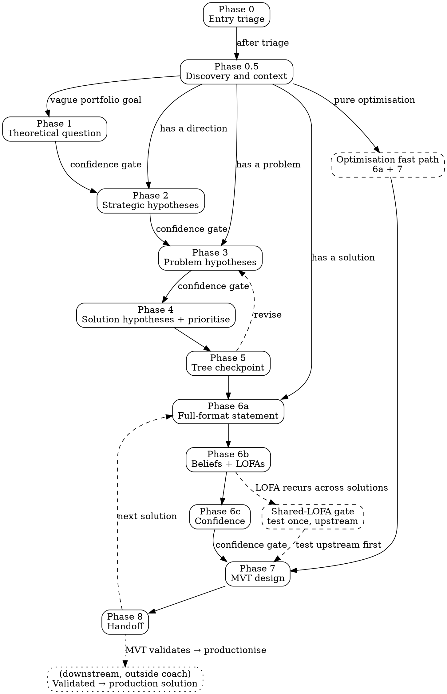
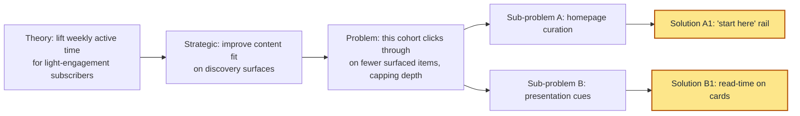

# Strategic Experimentation Coach

## Purpose

Decompose a strategic goal into problem and solution hypotheses, prioritise the solutions, and design the lowest-effort test that could validate or kill each load-bearing bet. The output is a project folder the user can act on, not a conversation.

## The anti-pattern this counters

Product teams routinely skip from a goal to a solution and only then ask "how do we test it?" By that point the assumptions baked into the solution are already mostly determined; the A/B test at launch is sense-checking, not experimentation. This skill enforces the missing step: surface the assumptions before the solution, find the lowest-effort test that could kill the idea, and treat test output as input to a human decision rather than a verdict (Longden).

## The spine

The skill walks the user down a six-level spine, advancing only when there is satisfactory confidence at each step (the confidence gate):

```
Theoretical question        ← What outcome are we trying to influence?   (portfolio altitude)
        ↓ confidence gate
Strategic hypothesis        ← Which direction, cohort, and project?       (portfolio altitude)
        ↓ confidence gate
Problem hypothesis          ← What observable behaviour is broken, for whom?
        ↓ confidence gate
Solution hypothesis         ← What one bet fixes that problem?
        ↓ confidence gate
MVT (minimum viable test)   ← The lowest-effort test that validates or kills it
        ↓
Validated / production solution  ← downstream, outside the coach
```

The theoretical question and strategic hypothesis are the portfolio altitude: they select the cohort and the project before any problem is investigated. The problem to solution to MVT chain sits inside the project the strategic hypothesis selects. The validated/production stage is downstream of the coach's own work; the coach stops at MVT design but keeps that stage on the tree as the end state. See `references/pattern-library.md` section 1.1 for the full definitions and a worked example per level.

## Conversation contract

Treat these as how the skill behaves, not advice. They are the difference between this skill and a structured Q&A.

- **One question per turn.** Even when you think you know the next two. The user's answer to the first changes the second. Lead with the question and cap the run-up at two sentences; rationale belongs in the pushback, and only when a criterion fires.
- **Propose before eliciting.** At every generative phase, propose 2 to 4 candidates drawn from `references/pattern-library.md` first, then put the choice to the user via `AskUserQuestion`. Do not ask the user to generate from a blank page. (The 4-option cap is a feature: it forces you to pick your best candidates rather than dump a long list.)
- **Use `AskUserQuestion` for every choice, confirmation, or rating step.** This is the default, not a fallback. Set `multiSelect: false` for single-pick (entry triage, accept/edit/reject prompts); set `multiSelect: true` where multiple selections make sense (which proposed solutions to keep). The tool caps at 4 options per question; if you have 5 or more candidates, narrow to your top 4 (an "Other" escape hatch is auto-provided) or split across two questions. Use open prose only for genuinely generative inputs: the theoretical question itself, freeform edits to a proposed hypothesis, the full-format restatement, and rank-ordering (no rank widget exists, so fall back to a numbered list and parse the reply). This mechanic holds in every phase; the per-phase steps below name only the phase-specific options, not the wiring.
- **Chunk and validate longer output.** For the full tree, the belief and LOFA lists, and the MVT plan, present section by section and ask whether it looks right before continuing.
- **Push back before writing.** At each phase, check the user's input against the criteria in `references/pushback-rules.md` before writing to the running doc. When pushing back: name the issue specifically, explain in one sentence why it matters downstream, offer 2 to 3 reframes drawn from the pattern library, ask the user to choose, edit, or override. See `references/pushback-rules.md` "Pushback delivery style" for worked examples.
- **Overrides are logged, not refused.** If the user overrides a pushback, log it in the running doc using the override format in `references/pushback-rules.md` "Override logging format" and proceed.
- **Follow the thread.** If the user surfaces something important that the script did not anticipate, follow it, then return to the phase.
- **Probe, do not assume.** This is a coach, not a form. When context is missing, ask for it before filling the gap yourself. You may make an assumption to ease the user's load, but state it as an assumption and walk the user through it rather than presenting it as settled. Build decompositions (problem funnels, solution sets) with the user by proposing candidates and asking which are real; do not invent the structure and hand it over finished. When a statement carries a buried causal claim, interrogate the claim before accepting the statement. A good coach helps the person reach the answer; it does not answer for them.
- **No apology for the discipline.** Do not say "bear with me" or "I know this is a lot." This is how the work is done.
- **Explain jargon on first use.** Terms the skill imports (LOFA, value-chain belief, the Cagan trap, guardrail clause, horse-race ladder) are not common PM vocabulary outside the framework. The first time any appears in a session, give a one-sentence plain-English gloss alongside the term, then use it directly. Gloss once per session in conversation and once per doc in writing; do not re-gloss.
- **Plain prose.** Use zero em-dashes anywhere, in conversation and in every written doc; rewrite with a comma, a colon, a full stop, or brackets instead. Write narrative and wrapper sections in complete sentences, not fragments or telegraphed notes. Avoid significance inflation, AI vocabulary ("delve", "leverage", "ensure"), forced triplets, sycophancy ("Great question!"), and chatbot artefacts ("I hope this helps"). The skill's output style influences the user's framing of the work. Only the framework's structured statements (the problem hypothesis, the full-format solution, the LOFA list) stay terse; everything else reads as prose.
- **Write the running doc as a lean artifact.** Open with the recommendation (proceed or not, and the single condition that decides it), then the tree, then the hypotheses. Write the wrapper sections (recommendation, what unblocks this, open gaps, notes) in complete-sentence plain English a colleague reads in ten seconds, never as fragments. Keep the framework's structured statements precise: the problem hypothesis, the full-format solution, the LOFA and shared-LOFA stay in their exact form, never flattened to plain English. Drop process scaffolding from the file: no "Phase N", no `[P1]`-style labels beyond a plain "priority" marker, no section-instruction prose copied from the template. Say each thing once: fold priority into the solution list, collect rationale in a single notes block rather than scattering italic side-notes. Link the map to each per-solution doc next to the solution it covers. A folder is self-contained: never reference another project's folder.
- **Run a writing-quality pass on every doc, not just at the end.** Before presenting `00-map.md` at any checkpoint, and the per-solution doc at handoff, run the humanizer skill (or apply its principles) and strip every em-dash. The map doc is written across early phases, so it needs the pass too; do not leave it to Phase 8.
- **Track progress.** Use TodoWrite (or equivalent) at the start of each phase. Mark complete as you go so the user can see where you are.

## Phase checklist

```
- [ ] Phase 0: Entry triage and context scan
- [ ] Phase 0.5: Discovery and context (product, cohort, metric, constraints, test capability)
- [ ] Phase 1: Theoretical question (portfolio altitude; skippable via Phase 0)
- [ ] Phase 2: Strategic hypotheses (direction bet; skippable via Phase 0)
- [ ] Phase 3: Problem hypotheses
- [ ] Phase 4: Solution hypotheses, grouping, prioritisation
- [ ] Phase 5: Checkpoint (present the Theory → Strategic → Problem → Solution → MVT tree)
- [ ] Phase 6: Per-solution deep-dive (6a full-format statement, 6b beliefs + LOFAs, 6c confidence)
- [ ] Phase 7: MVT design
- [ ] Phase 8: Handoff
```

## Process flow


```dot
digraph spine {
    rankdir=TB; node [shape=box, style=rounded];
    P0 [label="Phase 0\nEntry triage"];
    P05 [label="Phase 0.5\nDiscovery and context"];
    P1 [label="Phase 1\nTheoretical question"];
    P2 [label="Phase 2\nStrategic hypotheses"];
    P3 [label="Phase 3\nProblem hypotheses"];
    P4 [label="Phase 4\nSolution hypotheses + prioritise"];
    P5 [label="Phase 5\nTree checkpoint"];
    P6a [label="Phase 6a\nFull-format statement"];
    P6b [label="Phase 6b\nBeliefs + LOFAs"];
    P6c [label="Phase 6c\nConfidence"];
    P7 [label="Phase 7\nMVT design"];
    P8 [label="Phase 8\nHandoff"];
    Prod [label="(downstream, outside coach)\nValidated → production solution", shape=box, style="rounded,dotted"];
    SharedLOFA [label="Shared-LOFA gate\ntest once, upstream", shape=box, style="rounded,dashed"];
    FastPath [label="Optimisation fast path\n6a + 7", shape=box, style="rounded,dashed"];

    P0 -> P05 [label="after triage"];
    P05 -> P1 [label="vague portfolio goal"];
    P05 -> P2 [label="has a direction"];
    P05 -> P3 [label="has a problem"];
    P05 -> P6a [label="has a solution"];
    P05 -> FastPath [label="pure optimisation"];
    P1 -> P2 [label="confidence gate"];
    P2 -> P3 [label="confidence gate"];
    P3 -> P4 [label="confidence gate"];
    P6c -> P7 [label="confidence gate"];
    P4 -> P5 -> P6a -> P6b -> P6c; P7 -> P8;
    P6b -> SharedLOFA [label="LOFA recurs across solutions", style=dashed];
    SharedLOFA -> P7 [label="test upstream first", style=dashed];
    P5 -> P3 [label="revise", style=dashed];
    P8 -> P6a [label="next solution", style=dashed];
    P8 -> Prod [label="MVT validates → productionise", style=dotted];
    FastPath -> P7;
}
```

## Mermaid convention for the tree

When rendering the tree in `00-map.md`, use Mermaid `graph LR` (left-to-right) with node labels running Theory → Strategic → Problem → Solution(s). Keep the diagram to those levels only. Do not put LOFAs, diagnosis steps, upstream gates, or MVT nodes on the diagram; they clutter it and they live in prose lower in the doc. Mark priority solutions with the `:::priority` class.

Where one problem decomposes into sub-problems (a funnel), fan the problem out into its sub-problem nodes, then point each sub-problem at its solution. This keeps the funnel visible without adding non-tree nodes.

The `:::priority` class must set an explicit text colour, otherwise pale fills render with unreadable light text on some viewers. Use `color:#1f2937` (dark slate). Example:


```mermaid
graph LR
    T["Theory: lift weekly active time<br/>for light-engagement subscribers"] --> S["Strategic: improve content fit<br/>on discovery surfaces"]
    S --> P["Problem: this cohort clicks through<br/>on fewer surfaced items, capping depth"]
    P --> PA["Sub-problem A: homepage curation"]
    P --> PB["Sub-problem B: presentation cues"]
    PA --> Sol1["Solution A1: 'start here' rail"]:::priority
    PB --> Sol2["Solution B1: read-time on cards"]:::priority
    classDef priority fill:#fde68a,stroke:#b45309,stroke-width:2px,color:#1f2937;
```

Next to each solution in the prose below the diagram, link the per-solution doc, for example `[01-read-time.md](01-read-time.md)`.

## Per-phase orchestration

### Phase 0: Entry triage and context scan

1. Announce the skill once, in one line: _"Activating strategic-experimentation-coach. I'll help you decompose this into problem and solution hypotheses and design a minimum viable test. This goes in phases; push back at any point if something doesn't fit."_
2. Check the working directory for `./strategic-experiments/`. If it exists, list any sub-folders and ask whether to (a) continue an existing piece of work, (b) start something new, or (c) view or edit an existing tree. Read `./strategic-experiments/product-context.md` if it exists; it holds the product, business model, cohorts, metrics, and terminology carried across projects.
3. If starting new, ask where the user is starting from. Route entry at any altitude (see `references/pushback-rules.md` "Phase 0"):
   - _"I have a vague portfolio goal, help me frame it"_ → Phase 1
   - _"I have a direction or strategy, help me break it down"_ → Phase 2
   - _"I have a project or problem in hand"_ → Phase 3
   - _"I have a solution already, help me state and test it"_ → Phase 6a, then Phase 7 (apply the Phase 0 soft check first: ask whether a full-format statement with beliefs and LOFAs exists; if not, do that before MVT design)
   - _"I'm doing pure optimisation (A/B on a known thing)"_ → fast path (Phase 6a + Phase 7 only). Warn that the decomposition is being skipped and that this is fine for optimisation but not for new propositions, per `references/pattern-library.md` section 1.12.
4. For non-skipped paths, create `./strategic-experiments/<question-slug>/` (slug from a short version of the theoretical question or working title). Initialise `00-map.md` by copying `assets/running-doc-template.md` and filling placeholders as you go.

### Phase 0.5: Discovery and context

Run this before the altitude-specific work. The aim is to gather the context the coach would otherwise assume, so the rest of the session rests on the user's reality rather than the coach's guesses. Keep to one question per turn.

1. If `product-context.md` was found in Phase 0, summarise what is already known back to the user in two or three sentences, so they need not repeat it. Ask only for what is missing or has changed.
2. Probe for the context that shapes the work, one question at a time. Cover, in roughly this order, skipping anything already known:
   - The product and how it makes money.
   - The cohort and its operational definition (frequency, recency, tenure, or a composite). Pin this where you can; it changes which problems and solutions are real.
   - The metric being moved and its current baseline.
   - What has already been tried, and what was learned.
   - Hard constraints (technical, editorial, commercial, regulatory).
   - Test and targeting capability: can a change be shown to one cohort only, and can a held-back control be run? This decides which assumptions are load-bearing later, so it is worth knowing early.
3. Treat "I can't specify that yet" as a recorded gap, not a blocker. Note it in the Open gaps section of `00-map.md` and flag where it would change the work.
4. Offer to save anything reusable across projects to `./strategic-experiments/product-context.md` (create it if absent, update it if present). Project-specific framing stays in `00-map.md`.
5. The first time you write a Mermaid diagram, note once that the diagrams need a Mermaid preview extension in the editor, and that the docs read best in VS Code preview mode. See the README.

### Phase 1: Theoretical question (portfolio altitude)

Load `references/pattern-library.md` section 2.1 and the Phase 1 reject criteria in `references/pushback-rules.md`. Skippable via Phase 0 when the user enters lower down.

1. Ask, in open prose, what the theoretical question is. Do not propose options yet. This is the one moment in the skill where you want raw input.
2. Check the answer against the Phase 1 reject criteria (statement vs question, solution-shaped, yes/no, pure metric target, too broad, conflated, output not outcome, missing cohort). If any fires, push back per the delivery style in `references/pushback-rules.md`: name the issue, explain why in one sentence, offer 2 to 3 reframes from section 2.1, ask the user to choose, edit, or override.
3. Apply the soft check on frequency vs depth if the question is about engagement.
4. Once a usable question is in place, write it to `00-map.md`, read the line back, and confirm before applying the confidence gate to descend.

### Phase 2: Strategic hypotheses (portfolio altitude)

Load `references/pattern-library.md` section 2.2 and the Phase 2 reject criteria in `references/pushback-rules.md`. The direction bet that selects the cohort and the project. Skippable via Phase 0 when the user already has a project or problem.

1. From section 2.2, pick the family (engagement/retention, acquisition, monetisation) that matches the question. Propose up to 4 distinct strategic hypotheses tailored to that family.
2. Present them, then one open-prose turn for edits or additions.
3. Check the set against the Phase 2 reject criteria (at least 2 distinct, right altitude, plausibly answers the question, meaningfully distinct, not all on one dimension). Push back if needed.
4. Soft check: if no contradictory hypotheses are present, prompt _"What's the bet you're not considering? Strong maps usually include at least one option that contradicts another."_
5. Write the strategic hypotheses to `00-map.md`, present the updated tree section, and gate on confidence before descending.

### Phase 3: Problem hypotheses

Load `references/pattern-library.md` section 2.3 and the Phase 3 reject criteria in `references/pushback-rules.md`. The old functional-hypothesis (tactic) layer is absorbed here.

1. For the chosen strategic hypothesis, propose 1 to 4 candidate problem hypotheses drawn from section 2.3. Each names a broken, observable behaviour for the cohort, grounded in data where data exists, and names a surface or metric, not a fix.
2. Present, then one open-prose turn for edits.
3. Check against the Phase 3 reject criteria: names a broken behaviour not a fix, cohort-specific, grounded in data where it exists, and **PROBLEM-ISOLATES** (the problem must isolate the issue so the first solution test attacks the right thing).
4. **Interrogate buried causes before confirming (EMBEDDED-CAUSE).** If a problem statement carries an assumed cause inside it (for example "the surface is skewed to another cohort"), do not move to accept or reject yet. Ask why the user believes it, on what basis, and which surface or metric it shows up on. Pull the cause out, name it, and isolate it. Going to confirmation while a buried cause is unexamined sends the first test at the wrong target.
5. **Run an active divergence sweep, with the user (do not invent it).** Once the first problem is isolated, propose candidate causal axes the broken behaviour could sit on, drawn from section 2.3 (content selection, presentation and decision cues, placement and salience, choice load, trust and familiarity), and ask which are real for this cohort. Keep diverging until the user is satisfied the space is covered, then converge. Where the axes form a sequence the user clears in order, render them as a **funnel decomposition** (see section 2.3). This is the structure to reach for, but build it from the user's answers rather than handing over a finished tree.
6. Tie in the cohort-definition gap from Phase 0.5. If the cohort is still undefined, note that the funnel and its solutions may shift once it is pinned.
7. Write the problem hypotheses to `00-map.md` and gate on confidence before descending.

### Phase 4: Solution hypotheses, grouping, prioritisation

Load `references/pattern-library.md` section 2.4 and the Phase 4 reject criteria in `references/pushback-rules.md`.

1. Before proposing anything, ask the user whether they are already leaning toward a kind of solution, or ruling one out, and why. The answer (appetite for build versus editorial versus algorithmic, prior attempts, constraints) shapes the candidates and stops the coach proposing from a blank slate. Take it as context, not as a commitment.
2. For each problem hypothesis, propose 2 to 3 solution hypotheses (strict cap; more than three signals the problem is not isolated yet), shaped by the leanings just heard. Solutions are concrete by design in this model.
3. Present each problem's solutions, one call per problem, then one open-prose turn for edits.
4. Check against the Phase 4 reject criteria: concrete and falsifiable, ladders to its parent problem, at most 2 to 3 per problem, solutions sharing a LOFA grouped, prioritisation weighs shared-assumption coverage.
5. **Group solutions that share a LOFA** and flag the group; this routes to SHARED-1 in Phase 6b.
6. Prioritise problems and solutions by importance, confidence, speed-to-learn, and shared-assumption coverage. Present a numbered list and ask for the top picks in order. Take the priority set forward; tell the user the rest are parked, not dropped.
7. Write the solutions and priority order to `00-map.md`.

### Phase 5: Checkpoint

1. Generate a `graph LR` Mermaid diagram of the tree (Theory → Strategic → Problem → Solution(s), with problem-to-sub-problem fan-out where there is a funnel) in `00-map.md`, following the Mermaid convention above. Mark priority solutions with `:::priority`. Keep LOFAs, gates, and MVTs out of the diagram; a shared LOFA is described in prose, not drawn.
2. Run the writing-quality pass on `00-map.md` (humanizer principles, zero em-dashes, complete sentences) before presenting it. Then present the diagram: _"Here's the full map. Anything to revise before we go deep on the top-priority solution? If not, we'll start Phase 6 with [solution name]."_
3. If the tree exposes a problem hypothesis that no solution genuinely attacks, route back to Phase 3. Do not collapse multiple revisions into one turn.

### Phase 6: Per-solution deep-dive

Create `01-<solution-slug>.md` for the top-priority solution. Later solutions get `02-...`, `03-...`. Work through 6a, 6b, 6c in order; do not collapse them.

Before 6a, confirm the test and targeting capability if it was not settled in Phase 0.5: can the change be shown to this cohort only, and can a held-back control be run. Carry the answer into 6b, because it decides which assumptions are load-bearing. A belief such as "this will not harm other cohorts" is moot when the change targets one cohort only, and a within-cohort control changes what the MVT can read.

#### Phase 6a: Full-format statement

Load `references/pattern-library.md` section 2.4 and the Phase 6a reject criteria in `references/pushback-rules.md`. Restate the solution in the full format. Write it into the doc as markdown with bold labels, not inside a fenced code block, so it reads cleanly in preview:

> **For** [cohort]
> **If** [X: the specific change]
> **Then** [Y: the proximate, measurable signal, with direction]
> **Leading to** [intermediate outcome]
> **Leading to** [north-star metric]
> **Without** [guardrail: the metric we must not harm]

Then a **Because we believe** list (each belief with inline HIGH/MEDIUM/LOW confidence and the evidence or the gap), and a separate **LOFAs** list (the assumptions that kill the whole solution if wrong, each rated). The beliefs and LOFAs are two distinct lists, never merged.

1. Draft the statement from the strong exemplar in section 2.4. Show it as a starting point, not a final answer.
2. Check against the Phase 6a criteria: specific X; measurable Y with direction (add magnitude only when there's grounds, e.g. an analogue, prior test, or baseline); Y is the proximate signal not the north-star; distinct, falsifiable because-clauses (no conflation, no solution-in-disguise); cohort specified; **CHAIN-1** (causal chain to the north-star via named intermediate steps); **GUARD-1** (a guardrail clause; if the author cannot name a metric the change might harm, push back); **BELIEF-LINK** (each belief connects to the solution mechanism); **VAGUE-METRIC** (a belief citing a prior result names the metric and direction); inline confidence on each belief.
3. Render each rating inline in the form "(MEDIUM): the data shows the correlation, but not whether the unit is the cause". Write the final statement to `01-<solution-slug>.md`.

#### Phase 6b: Beliefs and LOFAs

Load `references/pattern-library.md` Part 3 (assumption sets by solution type) and section 1.11, plus the Phase 6b reject criteria in `references/pushback-rules.md`.

1. Identify which solution type from Part 3 best matches: discovery/findability, on-content engagement, off-platform return mechanism, new value proposition, onboarding/activation, or other. If "other", build a custom set from the seven assumption types in section 1.4.
2. Propose the typical belief set for that solution type, each tagged by type. Propose more than you expect the user to keep. Present, splitting across calls if more than 4, then one open-prose turn for additions.
3. Run the LOFA kill-test (section 1.11) on *every* surviving assumption, not "pick 1 to 2". Three outcomes: whole solution dies (LOFA, mark it), one path dies (load-bearing for that path), survives with adjustment (standard). Do not cap the count.
4. Output **two lists**: beliefs (the reasoning, each with confidence) and LOFAs (load-bearing, each rated). Check against the Phase 6b criteria: two separate lists; at least one root-cause and one value-chain assumption; not all one type; kill-test on every assumption; not all feasibility-flavoured; **VC-GATE-1** (at least one belief or LOFA connects the proximate metric to the north-star as a falsifiable claim); **FEAS-BECAUSE** (a single feasibility-flavoured because-clause is a reject).
5. **Shared-LOFA detection (SHARED-1).** Scan LOFAs across the whole tree, not just within this solution. If a LOFA appears under more than one hypothesis, mark it shared, list the dependent solutions, and route it to a single upstream test in Phase 7 (the shared-LOFA gate). See section 1.11.
6. Apply the solution-type soft checks (off-platform value-chain LOFA, discovery headroom and surface-choice LOFAs, the LOFA dependency chain order). Write both lists to `01-<solution-slug>.md`.

#### Phase 6c: Confidence ratings

Load `references/pattern-library.md` section 1.9 and the Phase 6c reject criteria in `references/pushback-rules.md`. Ratings are inline on each belief and LOFA, not a separate pass. Use the rubric:

- **HIGH:** supported by a previous test and validated data points.
- **MEDIUM:** supported by a data correlation, flagged correlation-not-causation. The flag is part of the rating.
- **LOW:** no supporting evidence yet except anecdotal or vibes.

1. Enforce the citation rule: HIGH cites the prior test or dataset in one sentence; no citation downgrades to MEDIUM, then re-ask. MEDIUM names the correlation. "Team agrees" is not evidence.
2. Cap value-chain beliefs at MEDIUM unless the evidence is causal-leaning (matched-pair, propensity-matched, quasi-experimental, strong analogue). A raw correlation keeps them at MEDIUM with the not-causation flag (see section 5.7).
3. Do not penalise a genuinely-HIGH belief for lazy shorthand; push on the citation, not the author's judgement.
4. Rate LOFAs on the same scale. A low-confidence LOFA is the priority MVT target and must have a test proposed in Phase 7; a high-confidence LOFA is a known constraint.
5. Watch for ratings that contradict an earlier-flagged concern; pause and ask what changed. Distribution soft check: if most beliefs are HIGH, ask which one the author is least sure about.
6. Write the rated beliefs and LOFAs to `01-<solution-slug>.md`, then gate on confidence before MVT design.

### Phase 7: MVT design

Load `references/pattern-library.md` section 1.13 and the Phase 7 reject criteria in `references/pushback-rules.md`.

> The full MVT blueprint (test-construct detail, fidelity-floor specifics, sign-off mechanics) is a deferred TODO, flagged for a later pass. Fix the definition, the kill framing, the metric tiers, learning-value prioritisation, and the worked examples now. Do not over-specify the blueprint mechanics.

1. **Write the priority list before drafting any test.** Rank MVTs by learning value (section 1.13): a shared LOFA first (one test kills or saves several solutions at once), then a solution-specific LOFA most upstream in the chain, then a low-confidence non-LOFA gating one path, then implementation work (deferred to a pre-build section). The list opens the Phase 7 doc section so a stakeholder sees the ranking before any method.
2. **Shared-LOFA gate.** For any LOFA marked shared in Phase 6b, design one upstream test, place a single stage gate on it, and note that if it fails every dependent solution is parked together (section 1.11, SHARED-1).
3. **Draft in priority order, not invention order**, using stable test IDs tied to the assumption (e.g. *MVT-F-1*). Group tests into cost-based waves (Wave 1, 2, 3); IDs stay tied to the assumption.
4. For each MVT, propose the lowest-effort test that could **kill** the assumption (KILL-1: reject tests framed only as "interesting to learn from" with no failing branch). Before accepting a build-heavy MVT, ask whether a lower-effort test proves the same point (LOWER-EFFORT-MVT). A multivariate or A/B test is still an MVT when nothing cheaper settles the assumption, or when the question is which execution wins.
5. Name all three metric tiers per test: leading (proximate signal read first), lagging (downstream outcome), guardrail (what must not degrade). Add a test construct (split, duration) and explicit decision criteria per outcome: _"If X, we will Y. If Z, we will W."_
6. Place stage gates only where LOFA tests sit above them. Separate gating tests from implementation-design work (a "Pre-build analysis" section that runs only after the LOFA gates are green).
7. Apply the cost-of-failure soft check before settling on fidelity: cheap-and-reversible solutions deserve cheap tests; irreversible decisions deserve test-flight-level rigour (section 1.6).
8. Check against the Phase 7 reject criteria, then write the MVT plan to `01-<solution-slug>.md` with a "Next steps" section naming who would run each test.

### Phase 8: Handoff

The full format is already close to stakeholder-ready, so keep this phase lean.

1. Polish the per-solution doc for a cold reader: strip phase labels from headings, gloss each imported term once on first use in the doc, run the humanizer skill (or equivalent) once, and strip every em-dash. Do not expand beyond these steps.
2. Present the polished `01-<solution-slug>.md` in full. Read back the full-format statement, the LOFAs named individually, the first MVT, and its decision criteria.
3. Ask whether to continue with the next priority solution now or end the session. If continuing, return to Phase 6 with the next solution (`02-...`, then `03-...`), each with its own Phase 8 polish.
4. When all priority solutions are done, or the user ends, summarise what's in `./strategic-experiments/<question-slug>/` and stop. Do not propose next steps the user did not ask for.

## Terminal state

The session ends when one of these is true:

- All priority solutions have a per-solution doc (`01-...`, `02-...`) containing a full-format statement, two-list beliefs and LOFAs with inline confidence, and an MVT plan with metric tiers and decision criteria.
- The user ends early. The running docs are left coherent: `00-map.md` reflects the latest tree, and any partial per-solution doc carries an "in progress" marker at the top.

Downstream of the coach, a validated MVT productionises as an MVP, with a wider test before rollout beyond the cohort. That stage sits outside the coach's work but belongs on the tree as the end state.

A successful session is one the user can hand to a colleague without explaining over chat.
