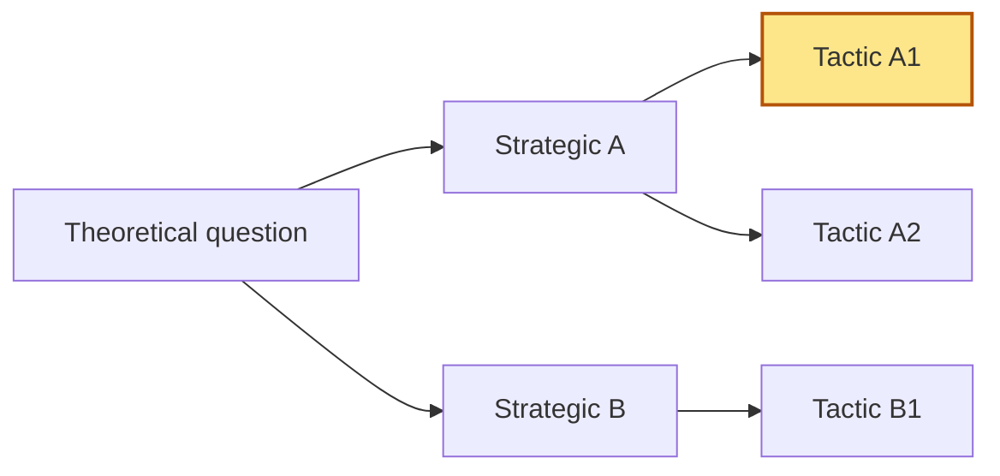

# {{Theoretical question — short slug}}

_Created: {{date}}_
_Last updated: {{date}}_
_Status: in progress_

## Theoretical question

> _The outcome-focused question this work is trying to answer. One sentence._

## Cohort / segment

_Who this work is for. Engagement temperature if relevant (hot / warm / cool / cold)._

## Strategic hypotheses

Bets on the direction of the answer. Aim for 2–4 distinct directions.

- **A —** _direction_
- **B —** _direction_
- **C —** _direction_

## Functional hypotheses (tactics)

Levers under each strategic hypothesis. Priority tactics marked `[P1]`, `[P2]`, `[P3]`.

### Under A — _direction_
- _tactic_
- _tactic_

### Under B — _direction_
- _tactic_
- _tactic_

## Priority order

1. `[P1]` _tactic_ — deep-dive in `01-<slug>.md`
2. `[P2]` _tactic_
3. `[P3]` _tactic_

## Tree map



## Decision log

Record reframes, drop-outs, and pushback overrides here so the reasoning survives the session.

```
Phase X — YYYY-MM-DD HH:MM:
  Skill flagged: {criterion}
  PM override: {reason}
  Risk accepted: {failure mode this exposes the work to}
```

## Open questions

- _Things to revisit before going deep on the next tactic._
