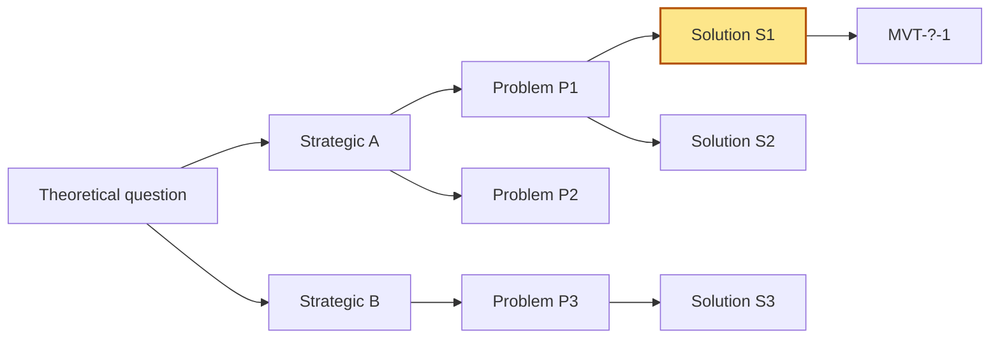

# {{Theoretical question: short slug}}

_Created: {{date}}_
_Last updated: {{date}}_
_Status: in progress_

## Theoretical question

> _The outcome-focused question this work is trying to answer. One sentence. Not a solution, not a yes/no, not a pure metric target._

## Cohort / segment

_Who this work is for. Any cohort segmentation relevant to this work (engagement state, lifecycle stage, plan tier, etc.)._

## Strategic hypotheses

Bets on the direction of the answer. Aim for 2 to 4 distinct directions. At least one should contradict another.

- **A:** _direction_
- **B:** _direction_
- **C:** _direction_

## Problem hypotheses

Each names a broken, observable behaviour for the cohort, grounded in data where data exists, and names a surface or metric, not a fix. Isolate the issue so the first solution test attacks the right thing.

### Under A: _direction_
- **P1:** _broken behaviour, cohort-specific, with the surface/metric named_
- **P2:** _broken behaviour_

### Under B: _direction_
- **P3:** _broken behaviour_

## Solution hypotheses

For each problem hypothesis, 2 to 3 solution hypotheses. Group any that share a LOFA. Priority solutions marked `[P1]`, `[P2]`, `[P3]`.

### Under P1: _problem_
- `[P1]` _named change to a named surface_ (deep-dive below)
- _solution_

### Under P3: _problem_
- `[P2]` _solution_

## Priority order

1. `[P1]` _solution_ (full format below)
2. `[P2]` _solution_
3. `[P3]` _solution_

## Tree map


```mermaid
graph LR
    Q["Theoretical question"] --> A["Strategic A"]
    Q --> B["Strategic B"]
    A --> P1["Problem P1"]
    A --> P2["Problem P2"]
    B --> P3["Problem P3"]
    P1 --> S1["Solution S1"]:::priority
    P1 --> S2["Solution S2"]
    P3 --> S3["Solution S3"]
    S1 --> M1["MVT-?-1"]
    classDef priority fill:#fde68a,stroke:#b45309,stroke-width:2px;
```

---

## Solution deep-dive: {{priority solution slug}}

### Full-format statement

> **For** {{cohort}}
> **If** {{the specific change to a specific surface}}
> **Then** {{the proximate, measurable signal, with direction; magnitude only if a baseline anchors it}}
> **Leading to** {{intermediate outcome}}
> **Leading to** {{north-star metric}}
> **Without** {{guardrail: the metric we must not harm}}
> **Because we believe:**
> - {{belief, connected to the solution mechanism}} ({{HIGH / MEDIUM / LOW}}): {{evidence, or the gap that would raise it}}
> - {{belief}} ({{HIGH / MEDIUM / LOW}}): {{evidence or gap}}

### LOFAs

The load-bearing assumptions that kill the solution if wrong. Each rated. At least one must be a value-chain LOFA connecting the proximate metric to the north-star. Mark any LOFA shared with another solution.

1. {{LOFA}} ({{HIGH / MEDIUM / LOW}}). _Value-chain / shared?_
2. {{LOFA}} ({{HIGH / MEDIUM / LOW}}).

### MVT (lowest-effort, kill-framed)

> {{The cheapest test that could kill this solution. Existing-data analysis before interviews before fake-door before A/B.}}

- **Leading metric:** {{proximate signal}}
- **Lagging metric:** {{downstream outcome vs a control/holdout}}
- **Guardrail metric:** {{what must not degrade}}
- **Decision criteria:** {{per outcome: what progresses, what kills, what re-routes. e.g. "If leading and lagging rise without the guardrail moving, progress; if leading rises but the guardrail breaks, the value-chain LOFA fired, stop."}}

_Validated and production solution are downstream of a passed MVT; note them here once reached._

---

## Decision log

Record reframes, drop-outs, and pushback overrides here so the reasoning survives the session.

```
Phase X, YYYY-MM-DD HH:MM:
  Skill flagged: {criterion}
  PM override: {reason}
  Risk accepted: {failure mode this exposes the work to}
```

## Open questions

- _Things to revisit before going deep on the next solution._
