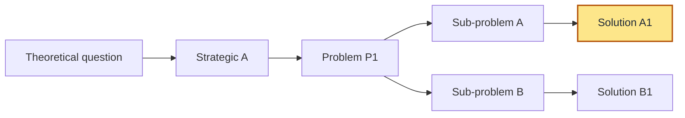

# {{Short working title}}

_{{status}} · {{one-line current state, written as a short sentence}}_

## Recommendation

<!-- The call, first, in complete sentences. Proceed or not, and the single condition that decides it. Plain English a colleague reads in ten seconds. No em-dashes. -->
> {{e.g. "Do not build yet. Validate the problem first by proving with data that X holds. If it does not, stop. The work is currently blocked because Y."}}

## The map

<!-- Theory to Strategic to Problem(s) to Solution(s) only. Fan a problem out into sub-problems where there is a funnel. Do not put LOFAs, gates, diagnoses, or MVTs on the diagram; they live in prose below. The priority class sets an explicit text colour so pale fills stay readable. -->

```mermaid
graph LR
    Q["Theoretical question"] --> A["Strategic A"]
    A --> P["Problem P1"]
    P --> PA["Sub-problem A"]
    P --> PB["Sub-problem B"]
    PA --> S1["Solution A1"]:::priority
    PB --> S2["Solution B1"]
    classDef priority fill:#fde68a,stroke:#b45309,stroke-width:2px,color:#1f2937;
```

## Theoretical question

<!-- One sentence. Outcome, not solution, not yes/no, not a pure metric target. -->
> {{question}}

## Cohort

<!-- Who this is for, in prose, with the operational definition if known. -->
{{who this is for, and how the cohort is defined}}

## Strategic hypotheses

<!-- 2 to 4 distinct directions; at least one should contradict another. -->
- **A:** {{direction}}
- **B:** {{direction}}

## Problem hypotheses

<!-- Keep framework-precise: a broken, observable behaviour for the cohort, with the surface or metric named, not a fix. Where there is a funnel, group sub-problems under the stage of the funnel they sit on. -->
- **P1:** {{broken behaviour, cohort-specific, surface or metric named}}

## Solution hypotheses

<!-- Keep framework-precise. 2 to 3 per problem. Mark the priority one with "(priority)". Link the per-solution doc next to the solution it covers. Note any shared LOFA in prose here, do not draw it. -->
- {{named change to a named surface}} **(priority)**. See [01-<slug>.md](01-<slug>.md).
- {{solution}}

Shared LOFA: {{the assumption that, if wrong, kills the grouped solutions together. Test it once, upstream, before building any dependent solution.}}

## What unblocks this, in order

<!-- The single ordered list of what has to happen before building, written as full sentences. One list only, no duplication. Lead with the test or data pull that gates everything else. -->
1. {{the first test or data pull, with the precise condition it must show and what happens if it fails}}
2. {{the next thing, e.g. an operational definition the first item needs}}

## Open gaps

<!-- Things not yet known that would change the work. Name the gap and where it bites. -->
- {{e.g. "The cohort definition is not set. It changes which problems and solutions are real."}}

## Notes

<!-- Rationale in short prose: inherited assumptions, parked options, and any pushback overrides (use the override format from pushback-rules.md). One place for all of it. -->
- {{note}}

## Per-solution docs

<!-- Links to the deep-dive files. The full-format statement, beliefs, LOFAs, and MVT plan stay framework-precise there. -->
- [01-<slug>.md](01-<slug>.md): {{solution name}}
