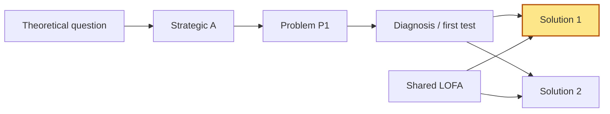

# {{Short working title}}

_{{status}} · {{one-line current state, e.g. "no data access yet · diagnosis queued"}}_

## Recommendation

<!-- The call, first. Proceed or not, and the single condition that decides it. Plain English. -->
> {{e.g. "Don't build yet. Validate the problem first: prove with data that X. If not, stop. Currently blocked — Y."}}

## The map

```mermaid
graph LR
    Q["Theoretical question"] --> A["Strategic A"]
    A --> P1["Problem P1"]
    P1 --> D["Diagnosis / first test"]
    D --> S1["Solution 1"]:::priority
    D --> S2["Solution 2"]
    L["Shared LOFA"] --> S1
    L --> S2
    classDef priority fill:#fde68a,stroke:#b45309,stroke-width:2px;
```

## Theoretical question

<!-- One sentence. Outcome, not solution, not yes/no, not a pure metric target. -->
> {{question}}

## Cohort

{{who this is for}}

## Strategic hypotheses

<!-- 2 to 4 distinct directions; at least one should contradict another. -->
- **A:** {{direction}}
- **B:** {{direction}}

## Problem hypotheses

<!-- Keep framework-precise: a broken, observable behaviour for the cohort, with the surface/metric named. Not a fix. -->
- **P1:** {{broken behaviour, cohort-specific, surface/metric named}}

## Solution hypotheses

<!-- Keep framework-precise. 2 to 3 per problem. Mark the priority one with "(priority)". Group any sharing a LOFA. Detail lives in the per-solution doc. -->
- {{named change to a named surface}} **(priority)**
- {{solution}}

**Shared LOFA:** {{the assumption that, if wrong, kills the grouped solutions together}}. Test once, upstream.

## Next: data ask / test queue

<!-- What unblocks the recommendation, in order. -->
1. {{the diagnosis or first test, with the precise condition it must show}}
2. {{any operational definition the above needs}}

## Notes

<!-- All rationale lives here, not scattered through the sections above. Drop-outs, inherited assumptions, parked options, pushback overrides. -->
- {{note}}

---

<!-- Per-solution deep-dives live in 01-<slug>.md, 02-<slug>.md, etc. The full-format statement, beliefs, LOFAs, and MVT plan stay framework-precise there. -->
